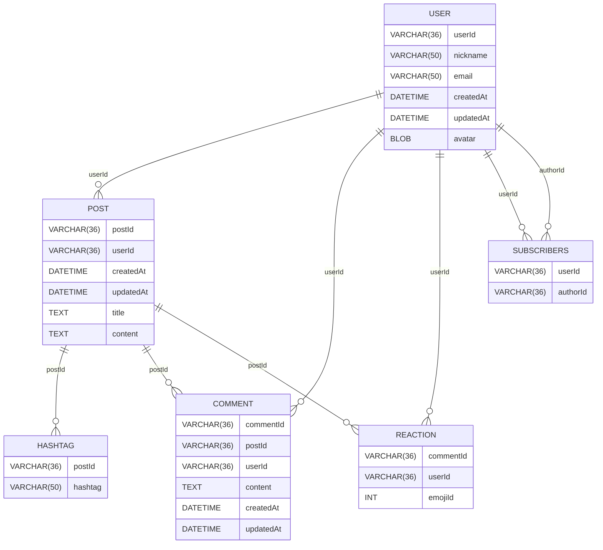

## Mariadb
The project uses mariadb database for some points:
- It's opensource (I love GNU projects btw)
- It's a fork of mysql
- It doesn't need a Pro license in production

### ER-diagramm

```mermaid
erDiagram
    USER ||--o{ POST: userId
    POST ||--o{ HASHTAG: postId
    POST ||--o{ COMMENT: postId
    USER ||--o{ COMMENT: userId
    USER ||--o{ REACTION: userId
    POST ||--o{ REACTION: postId 
    USER ||--o{ SUBSCRIBERS: userId
    USER ||--o{ SUBSCRIBERS: authorId
    USER{
        VARCHAR(36) userId
        VARCHAR(50) nickname
        VARCHAR(50) email
        DATETIME createdAt
        DATETIME updatedAt
        BLOB avatar
    }
    POST{
        VARCHAR(36) postId
        VARCHAR(36) userId
        DATETIME createdAt
        DATETIME updatedAt
        TEXT title
        TEXT content
    }
    HASHTAG{
        VARCHAR(36) postId
        VARCHAR(50) hashtag
    }
    COMMENT{
        VARCHAR(36) commentId
        VARCHAR(36) postId
        VARCHAR(36) userId
        TEXT content
        DATETIME createdAt
        DATETIME updatedAt
    }

    REACTION{
        VARCHAR(36) commentId
        VARCHAR(36) userId
        INT emojiId
    }
    SUBSCRIBERS{
        VARCHAR(36) userId
        VARCHAR(36) authorId
    }
```