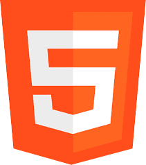
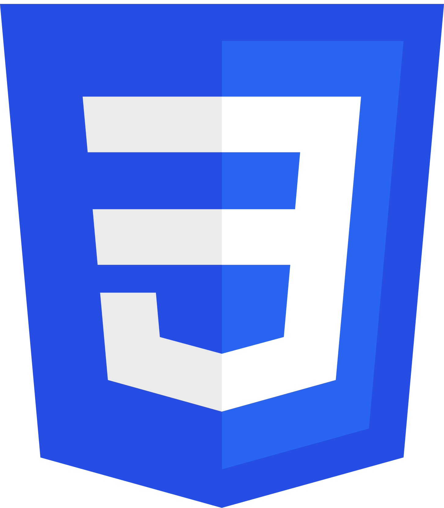
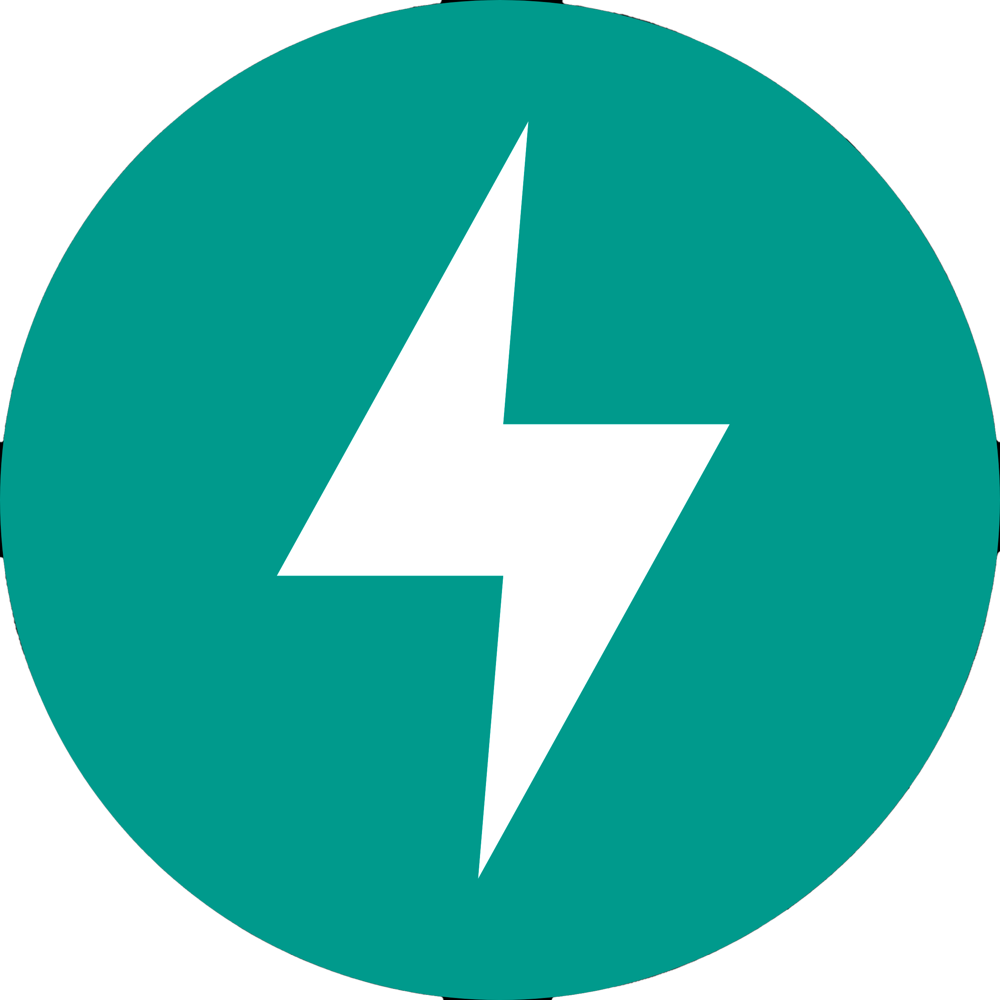
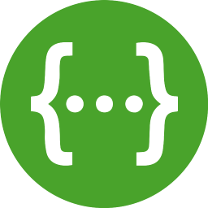
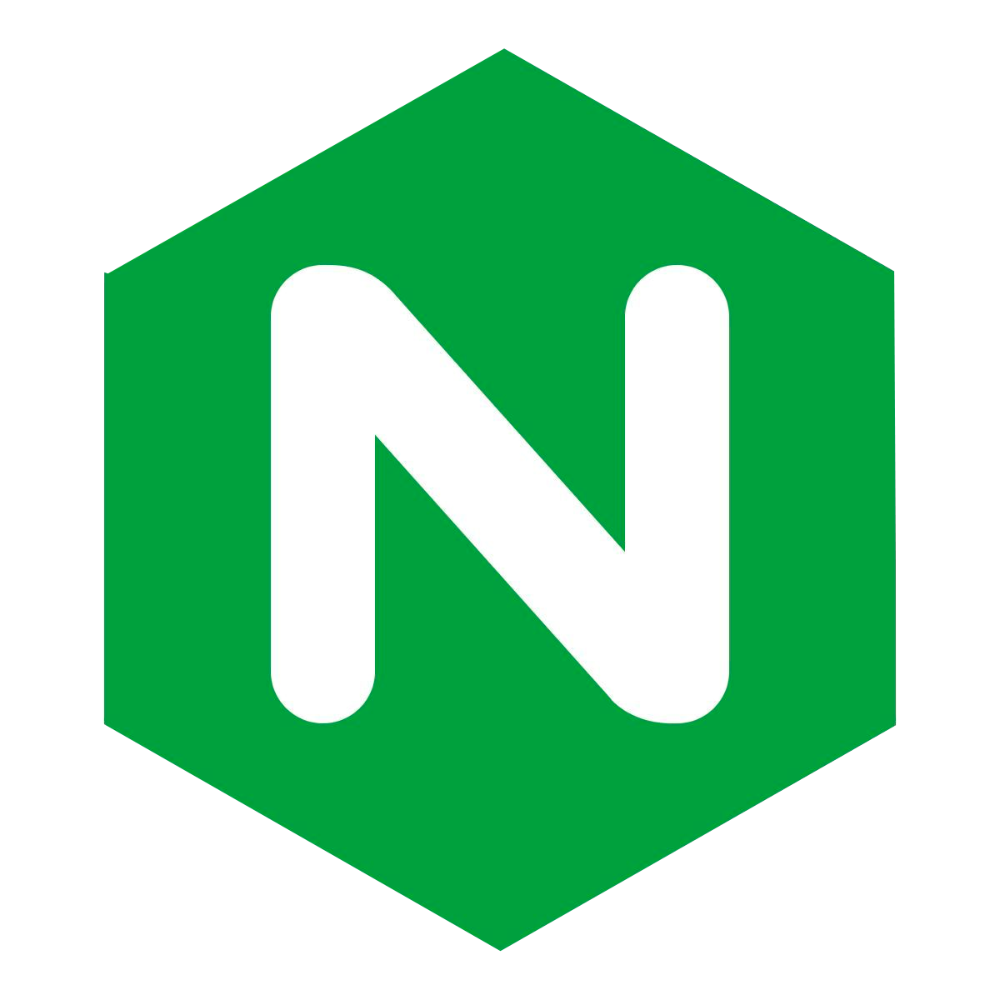
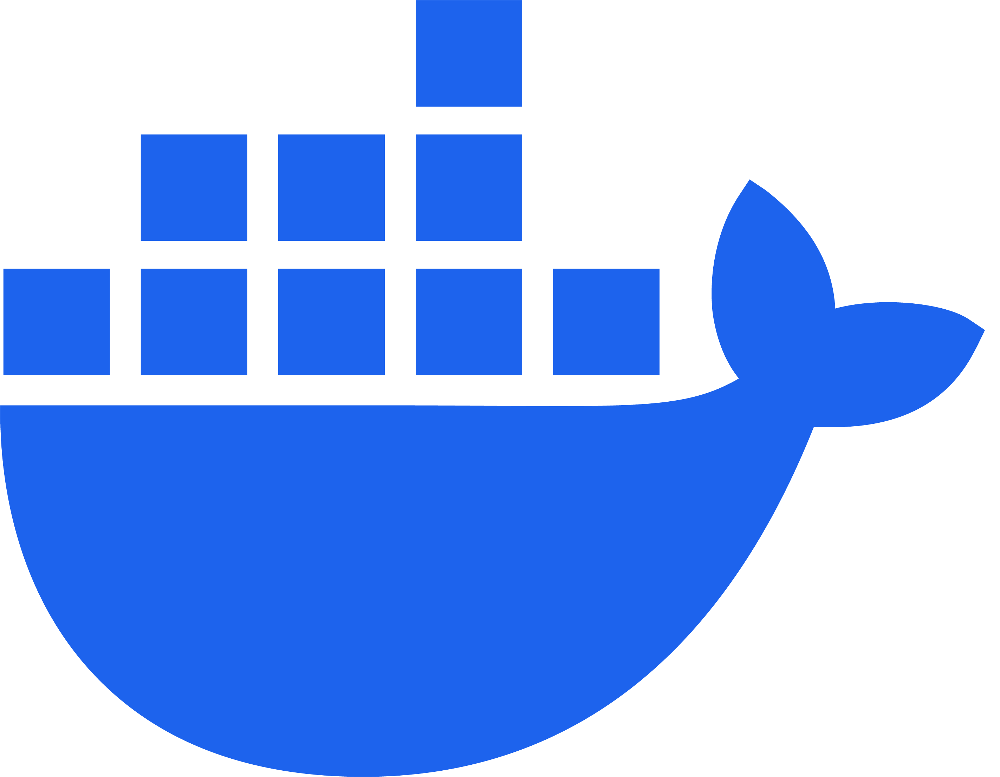

### Stack
The conventional and modern stack will be implemented to the project.  
Full list of technologies:  
  
#### **Frontend**  

 **React** - Javascript lib  
  
**Javascript** - main frontend language  
  
 **HTML** - markup  
  
 **CSS** - styles  
  
 **TypeScript** - second language  
  
#### **Backend**  
 **FastAPI** - main webdev framework  
  
 **Python** - main backend language  
  
 **Swagger** - testing and documentation  
  
 **Uvicorn** - fast framework for deploying FastAPI apps. It has acync websockets btw  
  
 **SQL Alchemy** - ORM to work with DB 
   
 **NginX** - web server  

#### **CI/CD**  
 **Docker (Compose)** - containerisation  
  
 **Ruff** - linter  
  
 **PyTest** - tests  

#### **Teacher**
 **Shadi Abdelsalam (Floydan)** - a high qualified web developer from Avito

### Scheme
